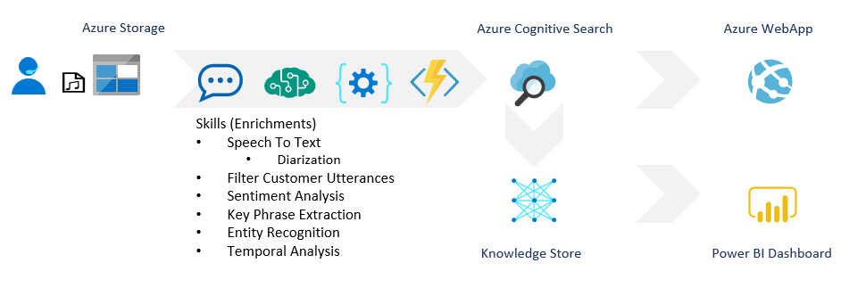

# Call Ceneter Analytics: Mining call center recordings for actionable intelligence

CallCenterAnalyticsKM is a Azure knowledge mining accelerator that allows you to get getsrted with mining your call center call recordings with just a few clicks.

This is a Azure ARM Template tht deploys the following assets:

1. Azure Cognitive Search Service
2. Azure Cognitive Services resource
3. Azure Cognitive Services Speech to Text resource
4. Azure Functions instance for some custom skills
5. Azure Webapp for initializing the solution and the search experience
6. Azure Application Insights resource to save logs from the webapp and functions

## Deployment 
To deploy the solution simply clic the "deploy to Azure button below

The deployment will require you to provide a prefix string which will be used to generate the names of all the resources.
The deploment should take a few minutes, once complete you should have all the resources deployed nd configured.

## Initialization
The solution needs to be initalized, simply find the URL to your webapp, it will be https://`{prefix}`callcenterapp.azurewebsites.net

Navigate to https://`{prefix}`callcenterapp.azurewebsites.net/admin?code=`{AppInsightsInstrumentationKey}`

Click on the Initialize button

## Getting Started

Navigate to the storage account created by the template and add a audio file to the `audio` container in blob storage. In a few minutes, your index should contain all the information you needed from that audio file.

Explore the results at https://`{prefix}`callcenterapp.azurewebsites.net
